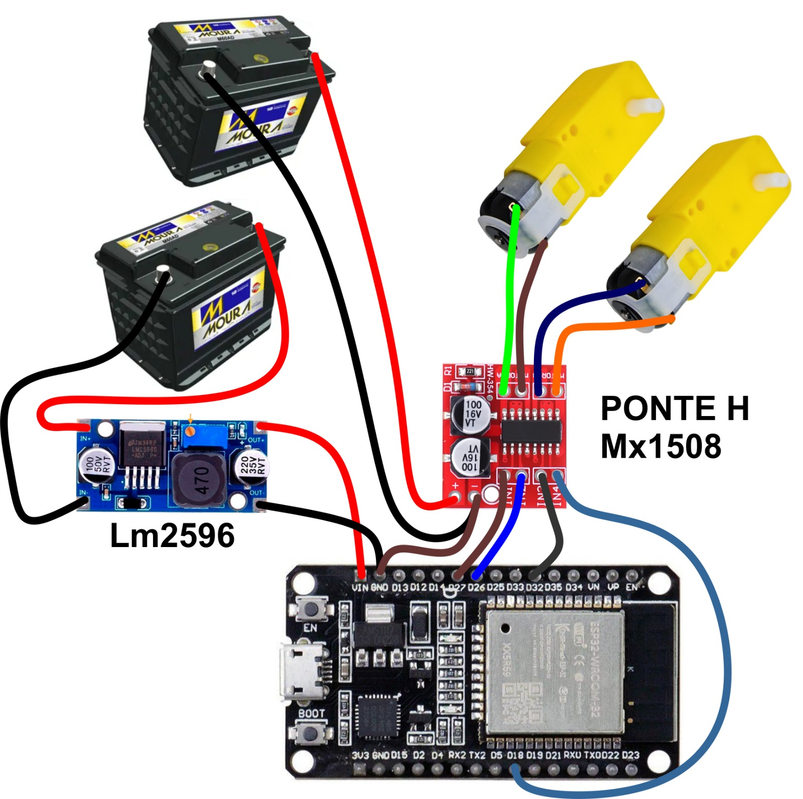
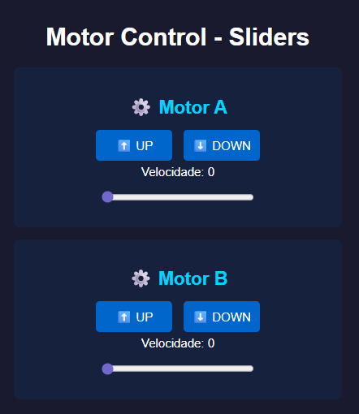
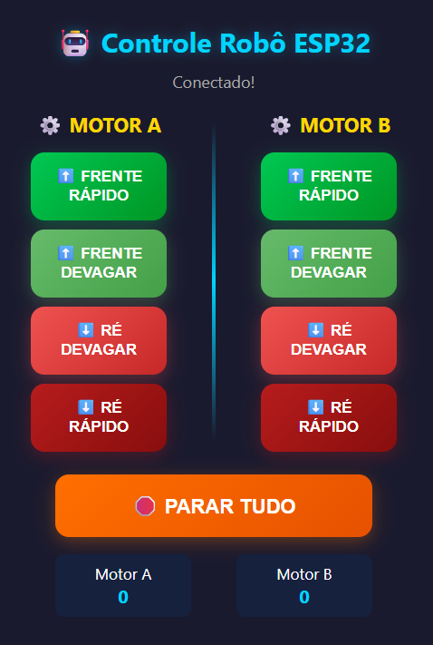
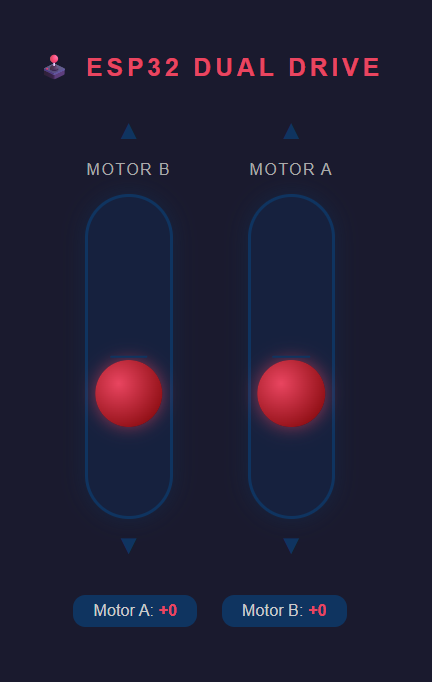

# ESP32 Web Motor Control

Sistema de controle de motores DC via Wi-Fi utilizando ESP32 e ponte H. O projeto cria uma página web hospedada diretamente no ESP32, permitindo controlar dois motores através de qualquer dispositivo conectado à rede criada pelo microcontrolador.

O objetivo é fornecer uma interface simples para testes, automação, robótica, guinchos, esteiras, mecanismos lineares e outros projetos que necessitem controlar direção e velocidade de motores DC.

---

# Recursos

* Controle de dois motores independentes.
* Interface web acessível por celular, tablet ou computador.
* Não necessita aplicativo.
* Funciona através de Access Point (AP) criado pelo ESP32.
* Controle de direção dos motores.
* Controle de velocidade por PWM.
* Fácil personalização da interface e dos parâmetros.

---

# Hardware Necessário

* ESP32
* MX1508 (driver de motores DC)
* LM2596 (regulador DC-DC com saída 5V)
* Motores DC
* Fonte de alimentação (entrada para LM2596 e MX1508)
* Cabos de conexão
* Capacitores de filtragem (conforme esquema)

---

# Ligações Utilizadas



## Alimentação

| Componente | Entrada      | Saída      |
| ---------- | ------------ | ---------- |
| Fonte      | +V (variável) | GND        |
| LM2596     | +V (6-40V)    | +5V (ESP32) |
| MX1508     | +V (indep.)   | GND        |

## Motores - Controle via MX1508

| Função      | GPIO ESP32 | Pino MX1508 |
| ----------- | ---------- | ----------- |
| Motor A IN1 | GPIO 18    | IN1         |
| Motor A IN2 | GPIO 32    | IN2         |
| Motor B IN1 | GPIO 27    | IN3         |
| Motor B IN2 | GPIO 26    | IN4         |

## Observações

* ESP32 alimentado pelo LM2596 (5V regulado)
* Motores alimentados pelo MX1508 com fonte independente
* Aterramento comum entre todos os componentes
* Capacitores de filtragem conforme esquema fornecido

> Caso utilize outro driver, os pinos podem ser alterados diretamente no código.

---

# Como Instalar

## 1. Instalar bibliotecas

As seguintes bibliotecas já fazem parte do pacote ESP32 para Arduino IDE:

```cpp
#include <WiFi.h>
#include <WebServer.h>
```

Nenhuma biblioteca adicional é necessária.

---

## 2. Configurar a placa

Na Arduino IDE:

```text
Ferramentas → Placa → ESP32 Dev Module
```

ou a placa ESP32 correspondente ao seu hardware.

---

## 3. Gravar o código

1. Conecte o ESP32 ao computador.
2. Selecione a porta serial correta.
3. Compile o projeto.
4. Grave o firmware.

---

# Como Acessar a Página

Após ligar o ESP32:

1. Procure pela rede Wi-Fi criada pelo dispositivo.
2. Conecte-se a ela.
3. Abra o navegador.
4. Acesse:

```text
http://192.168.4.1
```

A página de controle será exibida.

---

# Personalizando a Rede Wi-Fi

Localize a seção:

```cpp
const char* ap_ssid = "Minha Rede";
```

Altere para o nome desejado:

```cpp
const char* ap_ssid = "Meu Robo";
```

---

## Rede com Senha

Caso deseje proteger o acesso:

```cpp
WiFi.softAP("Meu Robo", "12345678");
```

A senha deve possuir pelo menos 8 caracteres.

---

# Personalizando os Pinos

Localize:

```cpp
const int motor_a_in1 = 32;
const int motor_a_in2 = 18;

const int motor_b_in1 = 27;
const int motor_b_in2 = 26;
```

Altere conforme necessário.

Exemplo:

```cpp
const int motor_a_in1 = 16;
const int motor_a_in2 = 17;

const int motor_b_in1 = 18;
const int motor_b_in2 = 19;
```

---

# Personalizando o PWM

## Frequência

```cpp
const int pwm_freq = 1000;
```

Exemplo:

```cpp
const int pwm_freq = 5000;
```

---

## Resolução

```cpp
const int pwm_resolution = 8;
```

Resoluções comuns:

| Bits | Faixa  |
| ---- | ------ |
| 8    | 0-255  |
| 10   | 0-1023 |
| 12   | 0-4095 |

---

# Estrutura do Projeto

A página web é gerada pela função:

```cpp
String html_page()
```

Ela contém:

* Botões de direção.
* Sliders de velocidade.
* Código JavaScript responsável pelo envio dos comandos.
* Estilos CSS da interface.

Toda personalização visual pode ser feita diretamente dentro dessa função.

---

# Controle dos Motores

O projeto utiliza duas rotas principais:

## Direção

```text
/dir?m=A&d=UP
```

Exemplos:

```text
/dir?m=A&d=UP
/dir?m=A&d=DOWN
/dir?m=B&d=UP
/dir?m=B&d=DOWN
```

---

## Velocidade

```text
/speed?m=A&s=200
```

Exemplos:

```text
/speed?m=A&s=255
/speed?m=A&s=100
/speed?m=B&s=180
```

---

# Versões Disponíveis

## esp32_motor_control_sliders_1 - Controle por Sliders



### Características

* Controle por sliders de velocidade.
* Velocidade variável de 0 a 255.
* Controle independente dos motores.
* Interface simples e leve.
* Ideal para testes de motores, guinchos, esteiras e mecanismos lineares.

### Funcionamento

1. Selecione a direção (UP ou DOWN).
2. Ajuste a velocidade usando o slider.
3. O motor permanece funcionando até receber outro comando.

### Vantagens

* ✅ Controle suave e gradual da velocidade
* ✅ Ideal para aplicações que exigem precisão
* ✅ Interface minimalista e responsiva

---

## esp32_web_motor_control_buttons_1 - Controle por Botões



### Características

* Controle por botões de direção e velocidade.
* Velocidade rápida (255) e lenta (180).
* Controle do tipo pressionar e segurar.
* Botão de parada geral.
* Interface otimizada para celulares e touch.

### Funcionamento

1. Pressione um botão (Frente Rápido, Frente Devagar, Ré Devagar ou Ré Rápido).
2. O motor gira enquanto o botão estiver pressionado.
3. Ao soltar o botão o motor para.

### Velocidades

```cpp
VEL_BAIXA = 180
VEL_ALTA  = 255
```

### Vantagens

* ✅ Controle intuitivo e responsivo
* ✅ Ideal para operação tátil em celulares
* ✅ Botão de parada de emergência
* ✅ Duas velocidades pré-configuradas

---

## esp32_web_motor_control_joystick_1 - Controle por Joystick Linear



### Características

* Controle por joystick linear vertical.
* Velocidade variável suave (0-255).
* Controle contínuo com feedback visual.
* Dois joysticks independentes (um para cada motor).
* Interface inspirada em controladores de jogos.
* Suporte a touch e mouse (desktop/mobile).

### Funcionamento

1. Deslize o joystick para cima = Frente (velocidade aumenta ao mover para cima).
2. Deslize o joystick para baixo = Ré (velocidade aumenta ao mover para baixo).
3. Libere para centro = Motor para.
4. Feedback visual em tempo real da velocidade.

### Vantagens

* ✅ Controle suave e natural (similar a joystick analógico)
* ✅ Feedback visual em tempo real
* ✅ Ideal para operação contínua e precisa
* ✅ Experiência semelhante a consoles de jogos
* ✅ Funciona perfeitamente em dispositivos touch

### Rota HTTP

```text
/joy?m=A&s=200&d=U
```

Parâmetros:
- `m` : Motor (A ou B)
- `s` : Velocidade (0-255)
- `d` : Direção (U = Frente, D = Ré)

---

# Aplicações

* Robôs móveis
* Carrinhos controlados por Wi-Fi
* Guinchos
* Elevadores experimentais
* Esteiras
* Mecanismos lineares
* Automação residencial
* Projetos educacionais
* Bancadas de testes

---

# Solução de Problemas

## Não consigo acessar a página

Verifique:

* Se o ESP32 iniciou corretamente.
* Se o celular está conectado à rede criada pelo ESP32.
* Se o endereço utilizado é:

```text
http://192.168.4.1
```

---

## O motor não gira

Verifique:

* Alimentação da ponte H.
* Alimentação dos motores.
* Ligações dos pinos.
* Compatibilidade da ponte H utilizada.

---

## O ESP32 reinicia

Possíveis causas:

* Fonte insuficiente.
* Queda de tensão causada pelos motores.
* Falta de aterramento comum entre ESP32 e driver.

---

# Licença

Este projeto pode ser utilizado, modificado e distribuído livremente para fins educacionais, pessoais e de pesquisa.

---

Desenvolvido por Gabriel J Santos.
